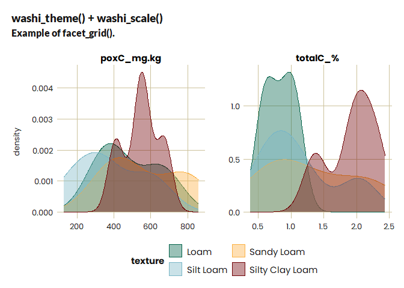

<!-- README.md is generated from README.Rmd. Please edit that file -->

# washi

<!-- badges: start -->

<a href="https://www.repostatus.org/#wip"></a>
[](https://github.com/WA-Department-of-Agriculture/washi/actions/workflows/R-CMD-check.yaml)
[](https://app.codecov.io/gh/WA-Department-of-Agriculture/washi?branch=main)

<!-- badges: end -->

Inspired by other branding R packages such as
[`glitr`](https://github.com/USAID-OHA-SI/glitr),
[`ratlas`](https://github.com/atlas-aai/ratlas), and
[`nmfspalette`](https://github.com/nmfs-fish-tools/nmfspalette), `washi`
provides color palettes and themes consistent with Washington Soil
Health Initiative (WaSHI) branding. This package is to be used only by
direct collaborators within WaSHI, though you are welcome to adapt the
package to suit your own organization’s branding.

## Installation

You can install the development version of washi from
[GitHub](https://github.com/) with:

``` r
# install.packages("devtools")
# devtools::install_github("WA-Department-of-Agriculture/washi")
library(washi)
```

## Requirements

### Install and register fonts

`washi` uses Poppins and Lato fonts. You can install these on your
computer by running:

``` r
washi_install_fonts()
```

This function will open a window with the font files for you to install,
and provides instructions for installation. Once they are installed, you
will need to register them for use in R with:

``` r
washi_register_fonts()
```

Then restart your R session (Ctrl + Shift + F10).

## Palettes

To list the names of all available palettes, call `names(washi_pal)`. To
view a palette, use the `washi_pal_view()` function.

#### All WaSHI standard colors

This palette is primarily to access individual brand colors for fonts,
table headers, graphic backgrounds, etc. These colors are not accessible
to those who may have color blindness.

Individual colors can be accessed with
`washi_pal[["standard"]][["green"]]`.

``` r
washi_pal_view("standard")
```


#### WaSHI colors adjusted to be color-blind safe

``` r
washi_pal_view("color_blind")
```


#### Color gradients

Available in green, blue, red, and gold.

``` r
washi_pal_view("green_gradient", n = 4, reverse = TRUE)
```


### Data

`washi` provides an example dataset, which was subset and anonymized
from the [WaSHI State of the Soils
Assessment](https://agr.wa.gov/departments/land-and-water/natural-resources/soil-health/state-of-the-soils).
This dataset comes in a long, tidy form with one measurement per row;
and in a wide form with one sample per row. Its purpose is to provide an
example soils dataset to use in plots and tables.

### Plots

`washi` provides `ggplot2` scale and theme functions that apply WaSHI
colors, fonts, and styling.

**Example workflow:**

``` r
library(extrafont) # Package must be loaded to use WaSHI fonts
#> Registering fonts with R
library(ggplot2)

# 1. Prepare data
example_data_long |>
  subset(measurement %in% c("totalC_%", "poxC_mg.kg")) |>
# 2. Pipe to ggplot()
  ggplot(aes(x = value, fill = texture, color = texture)) +
  labs(
    title = "washi_theme() + washi_scale()",
    subtitle = "Example of facet_grid()."
  ) +
  geom_density(alpha = 0.4) +
  facet_wrap(. ~ measurement, scales = "free") +
# 3. Add washi_theme() with argument to change legend position
  washi_theme(legend_position = "bottom") +
# 4. Add washi_scale()
  washi_scale() +
# 5. Tweak for your specific plot
  xlab(NULL) +
  guides(col = guide_legend(nrow = 2, byrow = TRUE))
#> Warning: Groups with fewer than two data points have been dropped.
#> Groups with fewer than two data points have been dropped.
#> Warning in max(ids, na.rm = TRUE): no non-missing arguments to max; returning
#> -Inf

#> Warning in max(ids, na.rm = TRUE): no non-missing arguments to max; returning
#> -Inf
```



### Tables

`washi` provides a function to create a `flextable` with WaSHI colors,
fonts, and styling.

``` r
example_data_wide |>
  head(5) |> 
  subset(select = c("sampleId", 
                    "crop", 
                    "totalN_%", 
                    "totalC_%")) |>
  washi_flextable(cols_bold = 1)
```

<div class="tabwid"><style>.cl-e688e0de{}.cl-e67f0794{font-family:'Lato';font-size:12pt;font-weight:bold;font-style:normal;text-decoration:none;color:rgba(255, 255, 255, 1.00);background-color:transparent;}.cl-e67f07b2{font-family:'Poppins';font-size:11pt;font-weight:bold;font-style:normal;text-decoration:none;color:rgba(0, 0, 0, 1.00);background-color:transparent;}.cl-e67f07b3{font-family:'Poppins';font-size:11pt;font-weight:normal;font-style:normal;text-decoration:none;color:rgba(0, 0, 0, 1.00);background-color:transparent;}.cl-e682983c{margin:0;text-align:center;border-bottom: 0 solid rgba(0, 0, 0, 1.00);border-top: 0 solid rgba(0, 0, 0, 1.00);border-left: 0 solid rgba(0, 0, 0, 1.00);border-right: 0 solid rgba(0, 0, 0, 1.00);padding-bottom:5pt;padding-top:5pt;padding-left:5pt;padding-right:5pt;line-height: 1;background-color:transparent;}.cl-e6829850{margin:0;text-align:left;border-bottom: 0 solid rgba(0, 0, 0, 1.00);border-top: 0 solid rgba(0, 0, 0, 1.00);border-left: 0 solid rgba(0, 0, 0, 1.00);border-right: 0 solid rgba(0, 0, 0, 1.00);padding-bottom:5pt;padding-top:5pt;padding-left:5pt;padding-right:5pt;line-height: 1;background-color:transparent;}.cl-e682985a{margin:0;text-align:right;border-bottom: 0 solid rgba(0, 0, 0, 1.00);border-top: 0 solid rgba(0, 0, 0, 1.00);border-left: 0 solid rgba(0, 0, 0, 1.00);border-right: 0 solid rgba(0, 0, 0, 1.00);padding-bottom:5pt;padding-top:5pt;padding-left:5pt;padding-right:5pt;line-height: 1;background-color:transparent;}.cl-e682b7c2{width:0.963in;background-color:rgba(2, 59, 44, 1.00);vertical-align: middle;border-bottom: 0 solid rgba(0, 0, 0, 1.00);border-top: 0 solid rgba(0, 0, 0, 1.00);border-left: 0 solid rgba(0, 0, 0, 1.00);border-right: 0 solid rgba(0, 0, 0, 1.00);margin-bottom:0;margin-top:0;margin-left:0;margin-right:0;}.cl-e682b7cc{width:1.68in;background-color:rgba(2, 59, 44, 1.00);vertical-align: middle;border-bottom: 0 solid rgba(0, 0, 0, 1.00);border-top: 0 solid rgba(0, 0, 0, 1.00);border-left: 0 solid rgba(0, 0, 0, 1.00);border-right: 0 solid rgba(0, 0, 0, 1.00);margin-bottom:0;margin-top:0;margin-left:0;margin-right:0;}.cl-e682b7e0{width:0.967in;background-color:rgba(2, 59, 44, 1.00);vertical-align: middle;border-bottom: 0 solid rgba(0, 0, 0, 1.00);border-top: 0 solid rgba(0, 0, 0, 1.00);border-left: 0 solid rgba(0, 0, 0, 1.00);border-right: 0 solid rgba(0, 0, 0, 1.00);margin-bottom:0;margin-top:0;margin-left:0;margin-right:0;}.cl-e682b7ea{width:0.953in;background-color:rgba(2, 59, 44, 1.00);vertical-align: middle;border-bottom: 0 solid rgba(0, 0, 0, 1.00);border-top: 0 solid rgba(0, 0, 0, 1.00);border-left: 0 solid rgba(0, 0, 0, 1.00);border-right: 0 solid rgba(0, 0, 0, 1.00);margin-bottom:0;margin-top:0;margin-left:0;margin-right:0;}.cl-e682b7eb{width:0.963in;background-color:transparent;vertical-align: middle;border-bottom: 1pt solid rgba(204, 194, 156, 1.00);border-top: 0 solid rgba(0, 0, 0, 1.00);border-left: 0 solid rgba(0, 0, 0, 1.00);border-right: 0 solid rgba(0, 0, 0, 1.00);margin-bottom:0;margin-top:0;margin-left:0;margin-right:0;}.cl-e682b7f4{width:1.68in;background-color:transparent;vertical-align: middle;border-bottom: 1pt solid rgba(204, 194, 156, 1.00);border-top: 0 solid rgba(0, 0, 0, 1.00);border-left: 0 solid rgba(0, 0, 0, 1.00);border-right: 0 solid rgba(0, 0, 0, 1.00);margin-bottom:0;margin-top:0;margin-left:0;margin-right:0;}.cl-e682b7f5{width:0.967in;background-color:transparent;vertical-align: middle;border-bottom: 1pt solid rgba(204, 194, 156, 1.00);border-top: 0 solid rgba(0, 0, 0, 1.00);border-left: 0 solid rgba(0, 0, 0, 1.00);border-right: 0 solid rgba(0, 0, 0, 1.00);margin-bottom:0;margin-top:0;margin-left:0;margin-right:0;}.cl-e682b812{width:0.953in;background-color:transparent;vertical-align: middle;border-bottom: 1pt solid rgba(204, 194, 156, 1.00);border-top: 0 solid rgba(0, 0, 0, 1.00);border-left: 0 solid rgba(0, 0, 0, 1.00);border-right: 0 solid rgba(0, 0, 0, 1.00);margin-bottom:0;margin-top:0;margin-left:0;margin-right:0;}.cl-e682b813{width:0.963in;background-color:transparent;vertical-align: middle;border-bottom: 1pt solid rgba(204, 194, 156, 1.00);border-top: 1pt solid rgba(204, 194, 156, 1.00);border-left: 0 solid rgba(0, 0, 0, 1.00);border-right: 0 solid rgba(0, 0, 0, 1.00);margin-bottom:0;margin-top:0;margin-left:0;margin-right:0;}.cl-e682b814{width:1.68in;background-color:transparent;vertical-align: middle;border-bottom: 1pt solid rgba(204, 194, 156, 1.00);border-top: 1pt solid rgba(204, 194, 156, 1.00);border-left: 0 solid rgba(0, 0, 0, 1.00);border-right: 0 solid rgba(0, 0, 0, 1.00);margin-bottom:0;margin-top:0;margin-left:0;margin-right:0;}.cl-e682b815{width:0.967in;background-color:transparent;vertical-align: middle;border-bottom: 1pt solid rgba(204, 194, 156, 1.00);border-top: 1pt solid rgba(204, 194, 156, 1.00);border-left: 0 solid rgba(0, 0, 0, 1.00);border-right: 0 solid rgba(0, 0, 0, 1.00);margin-bottom:0;margin-top:0;margin-left:0;margin-right:0;}.cl-e682b81c{width:0.953in;background-color:transparent;vertical-align: middle;border-bottom: 1pt solid rgba(204, 194, 156, 1.00);border-top: 1pt solid rgba(204, 194, 156, 1.00);border-left: 0 solid rgba(0, 0, 0, 1.00);border-right: 0 solid rgba(0, 0, 0, 1.00);margin-bottom:0;margin-top:0;margin-left:0;margin-right:0;}.cl-e682b81d{width:0.963in;background-color:transparent;vertical-align: middle;border-bottom: 1pt solid rgba(204, 194, 156, 1.00);border-top: 1pt solid rgba(204, 194, 156, 1.00);border-left: 0 solid rgba(0, 0, 0, 1.00);border-right: 0 solid rgba(0, 0, 0, 1.00);margin-bottom:0;margin-top:0;margin-left:0;margin-right:0;}.cl-e682b81e{width:1.68in;background-color:transparent;vertical-align: middle;border-bottom: 1pt solid rgba(204, 194, 156, 1.00);border-top: 1pt solid rgba(204, 194, 156, 1.00);border-left: 0 solid rgba(0, 0, 0, 1.00);border-right: 0 solid rgba(0, 0, 0, 1.00);margin-bottom:0;margin-top:0;margin-left:0;margin-right:0;}.cl-e682b826{width:0.967in;background-color:transparent;vertical-align: middle;border-bottom: 1pt solid rgba(204, 194, 156, 1.00);border-top: 1pt solid rgba(204, 194, 156, 1.00);border-left: 0 solid rgba(0, 0, 0, 1.00);border-right: 0 solid rgba(0, 0, 0, 1.00);margin-bottom:0;margin-top:0;margin-left:0;margin-right:0;}.cl-e682b827{width:0.953in;background-color:transparent;vertical-align: middle;border-bottom: 1pt solid rgba(204, 194, 156, 1.00);border-top: 1pt solid rgba(204, 194, 156, 1.00);border-left: 0 solid rgba(0, 0, 0, 1.00);border-right: 0 solid rgba(0, 0, 0, 1.00);margin-bottom:0;margin-top:0;margin-left:0;margin-right:0;}.cl-e682b830{width:0.963in;background-color:transparent;vertical-align: middle;border-bottom: 1pt solid rgba(204, 194, 156, 1.00);border-top: 1pt solid rgba(204, 194, 156, 1.00);border-left: 0 solid rgba(0, 0, 0, 1.00);border-right: 0 solid rgba(0, 0, 0, 1.00);margin-bottom:0;margin-top:0;margin-left:0;margin-right:0;}.cl-e682b831{width:1.68in;background-color:transparent;vertical-align: middle;border-bottom: 1pt solid rgba(204, 194, 156, 1.00);border-top: 1pt solid rgba(204, 194, 156, 1.00);border-left: 0 solid rgba(0, 0, 0, 1.00);border-right: 0 solid rgba(0, 0, 0, 1.00);margin-bottom:0;margin-top:0;margin-left:0;margin-right:0;}.cl-e682b83a{width:0.967in;background-color:transparent;vertical-align: middle;border-bottom: 1pt solid rgba(204, 194, 156, 1.00);border-top: 1pt solid rgba(204, 194, 156, 1.00);border-left: 0 solid rgba(0, 0, 0, 1.00);border-right: 0 solid rgba(0, 0, 0, 1.00);margin-bottom:0;margin-top:0;margin-left:0;margin-right:0;}.cl-e682b83b{width:0.953in;background-color:transparent;vertical-align: middle;border-bottom: 1pt solid rgba(204, 194, 156, 1.00);border-top: 1pt solid rgba(204, 194, 156, 1.00);border-left: 0 solid rgba(0, 0, 0, 1.00);border-right: 0 solid rgba(0, 0, 0, 1.00);margin-bottom:0;margin-top:0;margin-left:0;margin-right:0;}.cl-e682b83c{width:0.963in;background-color:transparent;vertical-align: middle;border-bottom: 1pt solid rgba(204, 194, 156, 1.00);border-top: 1pt solid rgba(204, 194, 156, 1.00);border-left: 0 solid rgba(0, 0, 0, 1.00);border-right: 0 solid rgba(0, 0, 0, 1.00);margin-bottom:0;margin-top:0;margin-left:0;margin-right:0;}.cl-e682b844{width:1.68in;background-color:transparent;vertical-align: middle;border-bottom: 1pt solid rgba(204, 194, 156, 1.00);border-top: 1pt solid rgba(204, 194, 156, 1.00);border-left: 0 solid rgba(0, 0, 0, 1.00);border-right: 0 solid rgba(0, 0, 0, 1.00);margin-bottom:0;margin-top:0;margin-left:0;margin-right:0;}.cl-e682b845{width:0.967in;background-color:transparent;vertical-align: middle;border-bottom: 1pt solid rgba(204, 194, 156, 1.00);border-top: 1pt solid rgba(204, 194, 156, 1.00);border-left: 0 solid rgba(0, 0, 0, 1.00);border-right: 0 solid rgba(0, 0, 0, 1.00);margin-bottom:0;margin-top:0;margin-left:0;margin-right:0;}.cl-e682b846{width:0.953in;background-color:transparent;vertical-align: middle;border-bottom: 1pt solid rgba(204, 194, 156, 1.00);border-top: 1pt solid rgba(204, 194, 156, 1.00);border-left: 0 solid rgba(0, 0, 0, 1.00);border-right: 0 solid rgba(0, 0, 0, 1.00);margin-bottom:0;margin-top:0;margin-left:0;margin-right:0;}</style><table data-quarto-disable-processing='true' class='cl-e688e0de'><thead><tr style="overflow-wrap:break-word;"><th class="cl-e682b7c2"><p class="cl-e682983c"><span class="cl-e67f0794">sampleId</span></p></th><th class="cl-e682b7cc"><p class="cl-e682983c"><span class="cl-e67f0794">crop</span></p></th><th class="cl-e682b7e0"><p class="cl-e682983c"><span class="cl-e67f0794">totalN_%</span></p></th><th class="cl-e682b7ea"><p class="cl-e682983c"><span class="cl-e67f0794">totalC_%</span></p></th></tr></thead><tbody><tr style="overflow-wrap:break-word;"><td class="cl-e682b7eb"><p class="cl-e6829850"><span class="cl-e67f07b2">D030301</span></p></td><td class="cl-e682b7f4"><p class="cl-e6829850"><span class="cl-e67f07b3">Wheat</span></p></td><td class="cl-e682b7f5"><p class="cl-e682985a"><span class="cl-e67f07b3">0.08</span></p></td><td class="cl-e682b812"><p class="cl-e682985a"><span class="cl-e67f07b3">0.67</span></p></td></tr><tr style="overflow-wrap:break-word;"><td class="cl-e682b813"><p class="cl-e6829850"><span class="cl-e67f07b2">D030302</span></p></td><td class="cl-e682b814"><p class="cl-e6829850"><span class="cl-e67f07b3">CRP/Conservation</span></p></td><td class="cl-e682b815"><p class="cl-e682985a"><span class="cl-e67f07b3">0.09</span></p></td><td class="cl-e682b81c"><p class="cl-e682985a"><span class="cl-e67f07b3">0.94</span></p></td></tr><tr style="overflow-wrap:break-word;"><td class="cl-e682b81d"><p class="cl-e6829850"><span class="cl-e67f07b2">D040401</span></p></td><td class="cl-e682b81e"><p class="cl-e6829850"><span class="cl-e67f07b3">Apple</span></p></td><td class="cl-e682b826"><p class="cl-e682985a"><span class="cl-e67f07b3">0.09</span></p></td><td class="cl-e682b827"><p class="cl-e682985a"><span class="cl-e67f07b3">0.87</span></p></td></tr><tr style="overflow-wrap:break-word;"><td class="cl-e682b830"><p class="cl-e6829850"><span class="cl-e67f07b2">D040402</span></p></td><td class="cl-e682b831"><p class="cl-e6829850"><span class="cl-e67f07b3">Green Manure</span></p></td><td class="cl-e682b83a"><p class="cl-e682985a"><span class="cl-e67f07b3">0.10</span></p></td><td class="cl-e682b83b"><p class="cl-e682985a"><span class="cl-e67f07b3">1.12</span></p></td></tr><tr style="overflow-wrap:break-word;"><td class="cl-e682b83c"><p class="cl-e6829850"><span class="cl-e67f07b2">D040403</span></p></td><td class="cl-e682b844"><p class="cl-e6829850"><span class="cl-e67f07b3">Cherry</span></p></td><td class="cl-e682b845"><p class="cl-e682985a"><span class="cl-e67f07b3">0.09</span></p></td><td class="cl-e682b846"><p class="cl-e682985a"><span class="cl-e67f07b3">0.86</span></p></td></tr></tbody></table></div>
