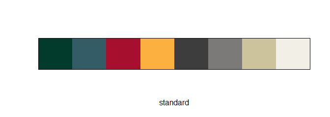
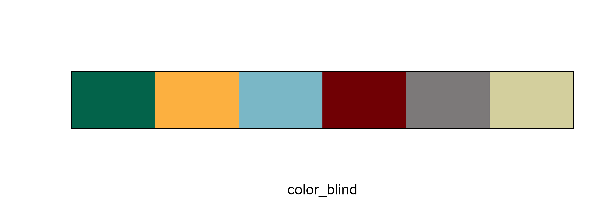
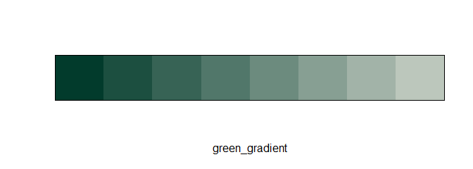

<!-- README.md is generated from README.Rmd. Please edit that file -->

# washi

<!-- badges: start -->

[](https://github.com/WA-Department-of-Agriculture/washi/actions/workflows/R-CMD-check.yaml)
[](https://lifecycle.r-lib.org/articles/stages.html#experimental)
[](https://app.codecov.io/gh/WA-Department-of-Agriculture/washi?branch=main)

<!-- badges: end -->

Inspired by other branding R packages such as
[`glitr`](https://github.com/USAID-OHA-SI/glitr),
[`ratlas`](https://github.com/atlas-aai/ratlas), and
[`nmfspalette`](https://github.com/nmfs-fish-tools/nmfspalette), `washi`
provides color palettes and themes consistent with Washington Soil
Health Initiative (WaSHI) branding.

## Installation

You can install the development version of washi from
[GitHub](https://github.com/) with:

``` r
# install.packages("devtools")
# devtools::install_github("WA-Department-of-Agriculture/washi")
library(washi)
```

## Palettes

To list the names of all available palettes, call
`names(palettes_washi)`. To view a palette, use the `palette_view()`
function.

##### All WaSHI standard colors

``` r
palette_view("standard")
```



##### WaSHI colors adjusted to be color-blind safe

``` r
palette_view("color_blind")
```



##### Color gradients

Available in green, blue, red, and gold.

``` r
palette_view("green_gradient")
```


