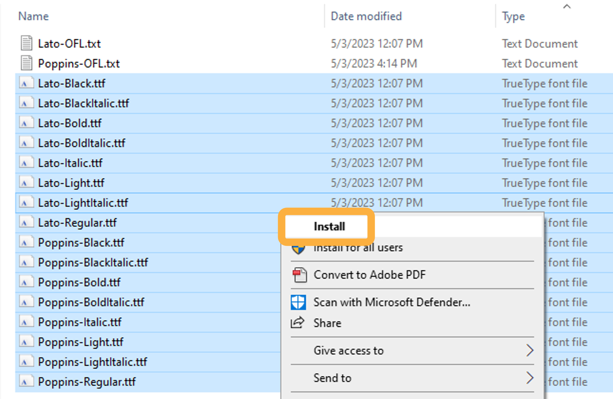
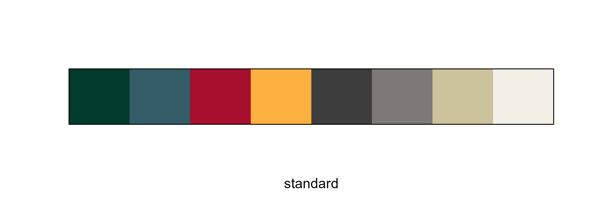
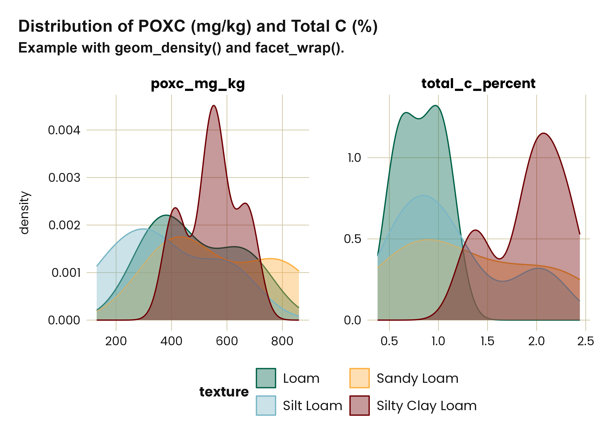
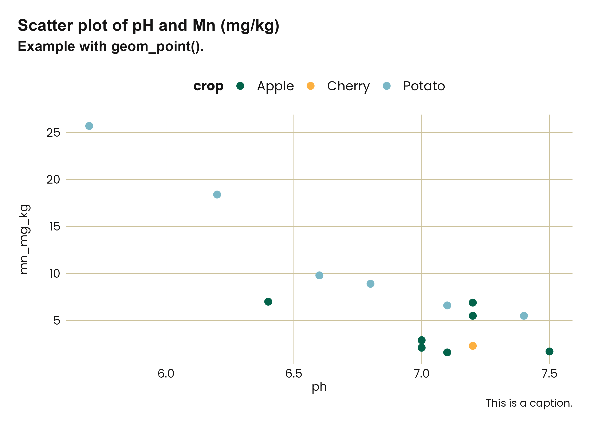

<!-- README.md is generated from README.Rmd. Please edit that file -->

# washi <a href="https://wa-department-of-agriculture.github.io/washi/"></a>

<!-- badges: start -->

[](https://CRAN.R-project.org/package=washi)
[](https://cranlogs.r-pkg.org/badges/grand-total/washi)
[](https://github.com/WA-Department-of-Agriculture/washi/actions/workflows/R-CMD-check.yaml)
[](https://app.codecov.io/gh/WA-Department-of-Agriculture/washi?branch=main)

<!-- badges: end -->

Inspired by other branding R packages such as
[`glitr`](https://github.com/USAID-OHA-SI/glitr),
[`ratlas`](https://github.com/atlas-aai/ratlas), and
[`nmfspalette`](https://github.com/nmfs-fish-tools/nmfspalette), `washi`
provides color palettes and themes consistent with [Washington Soil
Health Initiative](https://washingtonsoilhealthinitiative.com/) (WaSHI)
branding. This package is to be used only by direct collaborators within
WaSHI, though you are welcome to adapt the package to suit your own
organization’s branding.

Learn what functions are available and how to use them on the [function
reference
webpage](https://wa-department-of-agriculture.github.io/washi/reference/index.html).

For help within RStudio, place your cursor within the function name then
press `<F1>` to open the help page or `<F2>` to open the function source
code.

## Installation

Install `washi` from CRAN with:

``` r
install.packages("washi")
```

Or, you can install the development version of `washi` from
[GitHub](https://github.com/) with:

``` r
# install.packages("devtools")
devtools::install_github("WA-Department-of-Agriculture/washi")
```

Then load the package with:

``` r
library("washi")
```

## Fonts

`washi` uses Poppins and Lato fonts through the `ragg` and `systemfonts`
packages. You can install these fonts on your computer with:

``` r
# install.packages("ragg")
# install.packages("systemfonts")
washi_install_fonts()
#> ℹ To install the fonts on Windows:
#> • Select all .ttf files in the newly opened directory.
#> • Right-click + Install.
#> • Restart RStudio.
```




To make these fonts available in RStudio, set the Graphics backend to
use `AGG` in the RStudio options dialog box.


To make these fonts available when knitting to `RMarkdown` or `Quarto`,
use the following chunk setting:

``` r
knitr::opts_chunk$set(dev = "ragg_png")
```

Learn more about `ragg`: <https://ragg.r-lib.org/index.html>.

## Palettes

To list the names of all available palettes, call `names(washi_pal)`. To
view a palette, use the `washi_pal_view()` function.

#### All WaSHI standard colors

This palette is primarily to access individual brand colors for fonts,
table headers, graphic backgrounds, etc. These colors, when used
together in plots, are not accessible to those who may have color
blindness.

Individual colors can be accessed with
`washi_pal[["standard"]][["green"]]`.

``` r
washi_pal_view("standard")
```



#### WaSHI colors adjusted to be more color-blind friendly

``` r
washi_pal_view("color_blind")
```


#### Color gradients

Available in green, blue, red, and gold.

``` r
washi_pal_view("green_gradient", n = 4, reverse = TRUE)
```


## Data

`washi` provides an example dataset, which was subset and anonymized
from the [WaSHI State of the Soils
Assessment](https://agr.wa.gov/departments/land-and-water/natural-resources/soil-health/state-of-the-soils).
This dataset comes in a long, tidy form with one measurement per row;
and in a wide form with one sample per row. Its purpose is to provide an
example soils dataset to use in plots and tables.

## Plots

`washi` provides `ggplot2` scale and theme functions that apply WaSHI
colors, fonts, and styling.

### Example workflow:

``` r
library(ggplot2)

# 1. Prepare data
example_data_long |>
  subset(measurement %in% c("totalC_%", "poxC_mg.kg") &
    !texture == "Loamy Sand") |>
  # 2. Pipe to ggplot()
  ggplot(aes(x = value, fill = texture, color = texture)) +
  labs(
    title = "Distribution of POXC (mg/kg) and Total C (%)",
    subtitle = "Example with geom_density() and facet_wrap()."
  ) +
  geom_density(alpha = 0.4) +
  facet_wrap(. ~ measurement, scales = "free") +
  # 3. Add washi_theme() with argument to change legend position
  washi_theme(legend_position = "bottom") +
  # 4. Add washi_scale()
  washi_scale() +
  # 5. Tweak for your specific plot
  xlab(NULL) +
  guides(col = guide_legend(nrow = 2, byrow = TRUE))
```



### Scatter plot

``` r
# Single geom_point plot
example_data_wide |>
  subset(crop %in% c("Apple", "Cherry", "Potato")) |>
  ggplot(aes(x = pH, y = Mn_mg.kg, color = crop)) +
  labs(
    title = "Scatter plot of pH and Mn (mg/kg)",
    subtitle = "Example with geom_point().",
    caption = "This is a caption."
  ) +
  geom_point(size = 2.5) +
  washi_theme() +
  washi_scale()
```



### Barplot

``` r
example_data_wide |>
  ggplot(aes(x = forcats::fct_rev(forcats::fct_infreq(crop)))) +
  geom_bar(fill = washi_pal[["standard"]][["blue"]]) +
  geom_text(
    aes(
      y = after_stat(count),
      label = after_stat(count)
    ),
    stat = "count",
    hjust = 2.5,
    color = "white"
  ) +
  # Flip coordinates to accomodate long crop names
  coord_flip() +
  labs(
    title = "Number of samples in each crop",
    subtitle = "Example plot with geom_bar() without gridlines.",
    y = NULL,
    x = NULL
  ) +
  # Turn gridlines off
  washi_theme(gridline_y = FALSE, gridline_x = FALSE) +
  # Remove x-axis
  theme(axis.text.x = element_blank())
```


### Tables

`washi` provides a function to create a `flextable` with WaSHI colors,
fonts, and styling.

``` r
ft <- example_data_wide |>
  head(5) |>
  subset(select = c(
    "sampleId",
    "crop",
    "totalN_%",
    "totalC_%"
  )) |>
  washi_flextable(cols_bold = 1)
```


